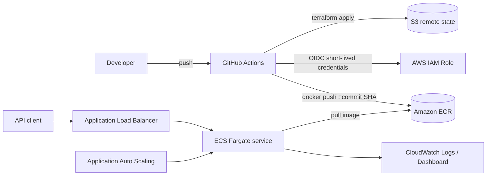

# AWS ECS ML API Lab

Một bài lab CI/CD hoàn chỉnh để đưa model machine learning từ laptop lên AWS ECS
Fargate. Repo bao gồm API, model training gate, container Distroless chạy non-root,
Terraform, GitHub Actions dùng OIDC, quan sát hệ thống và script dọn sạch tài nguyên.

> [!WARNING]
> Lab tạo ALB, Fargate và CloudWatch có thể phát sinh phí. Hãy chạy
> `./scripts/destroy.ps1` ngay sau khi thực hành. Thiết kế không dùng NAT Gateway
> để giảm chi phí, nhưng đây không phải một bài lab hoàn toàn miễn phí.

## Bạn sẽ học được gì?

- Train và kiểm tra accuracy trước khi đóng gói model.
- Thiết kế health check, validation và structured request log cho FastAPI.
- Build image nhỏ hơn, chạy bằng user không có quyền root.
- Dựng VPC, ECR, ECS Fargate, ALB, IAM, CloudWatch bằng Terraform.
- Dùng GitHub OIDC thay cho access key dài hạn trong repository secrets.
- Deploy image theo Git commit SHA, smoke-test và teardown có kiểm soát.

## Kiến trúc



Workload nằm trong VPC riêng với hai public subnet ở hai Availability Zone. Task
được gán public IP để truy cập ECR và CloudWatch mà không cần NAT Gateway; security
group chỉ cho phép ALB gọi cổng `8000` của task. Đây là lựa chọn có chủ đích cho
lab ngắn hạn, không phải mẫu mạng production tuyệt đối.

## Cấu trúc repo

```text
app/                    FastAPI inference service
tests/                  API tests
train.py                deterministic training + accuracy gate
Dockerfile              multi-stage Distroless non-root runtime image
infra/bootstrap/        S3 remote state + GitHub OIDC deployment role
infra/                  ECS workload and observability
scripts/                PowerShell lifecycle scripts
.github/workflows/      CI and manual deploy/destroy workflows
```

## Chạy local

Yêu cầu: Docker Desktop. Python local là tùy chọn.

```powershell
docker build -t iris-api:local .
docker run --rm -p 8000:8000 iris-api:local
```

Mở `http://localhost:8000/docs`, hoặc thử:

```powershell
Invoke-RestMethod http://localhost:8000/health/ready

Invoke-RestMethod -Method Post http://localhost:8000/predict `
  -ContentType "application/json" `
  -Body '{"sepal_length":5.1,"sepal_width":3.5,"petal_length":1.4,"petal_width":0.2}'
```

Nếu đã có Python 3.13:

```powershell
python -m venv .venv
./.venv/Scripts/Activate.ps1
pip install -r requirements-dev.txt
python train.py
ruff check .
pytest
```

`train.py` dùng split có stratify và random seed cố định. Pipeline thất bại nếu
accuracy thấp hơn 90%, vì vậy model kém chất lượng không đi tiếp đến bước build.

## Deploy từ máy cá nhân

### 1. Chuẩn bị

- AWS CLI đã đăng nhập và có quyền tạo IAM, S3, VPC, ECR, ECS, ALB, CloudWatch.
- Terraform `>= 1.10`, Docker Desktop, Git và GitHub CLI (`gh auth login`).
- AWS region mặc định của lab là `us-east-1`.

Kiểm tra danh tính trước khi tạo tài nguyên:

```powershell
aws sts get-caller-identity
gh repo view --json nameWithOwner
```

### 2. Bootstrap state và GitHub OIDC

Lệnh này tạo S3 state bucket, GitHub OIDC provider, deployment role và tự ghi năm
repository variables: `AWS_REGION`, `AWS_ROLE_ARN`, `TF_STATE_BUCKET`,
`PROJECT_NAME`, `ENVIRONMENT`.

```powershell
./scripts/bootstrap.ps1
```

OIDC provider là tài nguyên cấp account và chỉ được có một provider cho URL của
GitHub. Nếu account đã có provider đó, dùng:

```powershell
./scripts/bootstrap.ps1 -UseExistingOidcProvider
```

### 3. Deploy và kiểm chứng

```powershell
./scripts/deploy.ps1
```

Script thực hiện tuần tự:

1. Khởi tạo S3 backend với native state locking.
2. Tạo ECR trước, build image và push tag là Git SHA.
3. Dựng toàn bộ workload bằng Terraform.
4. Chờ ALB healthy, gọi `/health/ready` và `/predict`.

Các output hữu ích:

```powershell
terraform -chdir=infra output
aws ecs list-services --cluster ecs-ml-lab-dev
aws logs tail /ecs/ecs-ml-lab-dev --follow
```

### 4. Teardown

Xóa workload (kể cả inactive task-definition revisions), bootstrap và các
GitHub variables do bootstrap đã tạo:

```powershell
./scripts/destroy.ps1
```

Muốn giữ S3 state bucket và GitHub role cho lần lab sau:

```powershell
./scripts/destroy.ps1 -KeepBootstrap
```

Sau teardown, kiểm tra nhanh rằng các resource mang tên lab không còn:

```powershell
aws ecs list-clusters
aws ecr describe-repositories --query "repositories[?contains(repositoryName, 'ecs-ml-lab')]"
aws elbv2 describe-load-balancers --query "LoadBalancers[?contains(LoadBalancerName, 'ecs-ml-lab')]"
```

Lần đầu dùng Application Auto Scaling, AWS có thể tạo một service-linked role
cấp account để tái sử dụng cho mọi ECS service. Role này không phát sinh phí và
script không tự xóa vì có thể đang được workload khác dùng. Chỉ xóa thủ công khi
bạn đã xác nhận account không còn ECS scalable target nào.

## GitHub Actions pipeline

`CI` chạy khi mở pull request hoặc push lên `main`:

- retrain model và áp accuracy gate;
- Ruff + Pytest với coverage tối thiểu 85%;
- build/start container và gọi endpoint thật;
- format/validate cả hai Terraform root module.

`AWS lab lifecycle` là workflow chạy thủ công:

- chọn `deploy` để build, push ECR, apply và smoke-test;
- chọn `destroy` để xóa workload;
- credentials là token OIDC ngắn hạn, không lưu AWS access key trên GitHub.

Vào **Actions → AWS lab lifecycle → Run workflow**. Bootstrap phải tồn tại trước
khi workflow có thể assume role. Workflow `destroy` giữ bootstrap; dùng script
local để xóa cả bootstrap sau buổi học.

## API contract

| Method | Path | Mục đích |
|---|---|---|
| `GET` | `/` | Metadata và version đang deploy |
| `GET` | `/health/live` | Kiểm tra process còn sống |
| `GET` | `/health/ready` | Kiểm tra model đã load |
| `POST` | `/predict` | Phân loại Iris và trả xác suất từng class |
| `GET` | `/docs` | Swagger UI |

Ví dụ response:

```json
{
  "class_id": 0,
  "class_name": "setosa",
  "confidence": 1.0,
  "probabilities": {
    "setosa": 1.0,
    "versicolor": 0.0,
    "virginica": 0.0
  },
  "model_version": "iris-rf-42"
}
```

Mọi response có header `x-request-id`; cùng ID được ghi vào CloudWatch Logs để
truy vết request.

## Các bài mở rộng gợi ý

1. Thêm ACM certificate và HTTPS listener; redirect HTTP sang HTTPS.
2. Chuyển task vào private subnet và so sánh NAT Gateway với VPC endpoints.
3. Thêm canary hoặc blue/green deployment bằng CodeDeploy.
4. Đẩy model artifact riêng lên S3 và tải model theo version lúc startup.
5. Thêm load test để quan sát policy autoscaling ở ngưỡng CPU 65%.
6. Tách `dev` và `prod`, thêm GitHub Environment approval cho production.

## Troubleshooting

- **Task không start:** xem stopped reason bằng
  `aws ecs describe-tasks`, sau đó đọc log group `/ecs/ecs-ml-lab-dev`.
- **Target unhealthy:** kiểm tra target group health và security group; endpoint
  ALB dùng `/health/ready`.
- **ECR báo tag đã tồn tại:** repository dùng immutable tag. Tạo commit mới hoặc
  truyền `-ImageTag` mới cho script.
- **OIDC provider đã tồn tại:** bootstrap với `-UseExistingOidcProvider`.
- **State bị lock:** không xóa lock tùy tiện; xác nhận workflow khác đã kết thúc,
  rồi dùng `terraform force-unlock <LOCK_ID>` nếu Terraform hướng dẫn.

## License

[MIT](LICENSE)
