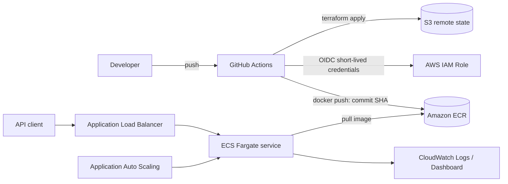

# AWS ECS ML API Lab

A complete CI/CD lab for taking a machine learning model from a laptop to AWS
ECS Fargate. The repository includes an inference API, a model quality gate, a
non-root Distroless container, Terraform infrastructure, GitHub Actions with
OIDC, observability, and scripts that clean up the lab resources.

> [!WARNING]
> This lab creates an Application Load Balancer, Fargate tasks, and CloudWatch
> resources that may incur AWS charges. Run `./scripts/destroy.ps1` as soon as
> you finish the lab. The design avoids a NAT Gateway to reduce cost, but the
> lab is not guaranteed to be free.

## What you will learn

- Train a model and enforce an accuracy threshold before packaging it.
- Add health checks, input validation, and structured request logging to FastAPI.
- Build a small container image that runs as a non-root user.
- Provision a VPC, ECR, ECS Fargate, ALB, IAM, and CloudWatch with Terraform.
- Use GitHub OIDC instead of storing long-lived AWS access keys in repository
  secrets.
- Deploy images tagged with a Git commit SHA, run smoke tests, and perform a
  controlled teardown.

## Architecture



The workload runs in a dedicated VPC with two public subnets across two
Availability Zones. Each task receives a public IP so it can reach ECR and
CloudWatch without a NAT Gateway. Its security group only accepts traffic on
port `8000` from the ALB. This is an intentional short-lived lab design, not a
production network reference architecture.

## Repository layout

```text
app/                    FastAPI inference service
tests/                  API and model service tests
train.py                deterministic training and accuracy gate
Dockerfile              multi-stage, non-root Distroless image
infra/bootstrap/        S3 remote state and GitHub OIDC deployment role
infra/                  ECS workload and observability
scripts/                PowerShell lifecycle scripts
.github/workflows/      CI and manual deploy/destroy workflows
```

## Run locally

Docker Desktop is required. A local Python installation is optional.

```powershell
docker build -t iris-api:local .
docker run --rm -p 8000:8000 iris-api:local
```

Open `http://localhost:8000/docs`, or try the API from PowerShell:

```powershell
Invoke-RestMethod http://localhost:8000/health/ready

Invoke-RestMethod -Method Post http://localhost:8000/predict `
  -ContentType "application/json" `
  -Body '{"sepal_length":5.1,"sepal_width":3.5,"petal_length":1.4,"petal_width":0.2}'
```

If Python 3.13 is installed:

```powershell
python -m venv .venv
./.venv/Scripts/Activate.ps1
pip install -r requirements-dev.txt
python train.py
ruff check .
pytest
```

`train.py` uses a stratified split and a fixed random seed. The pipeline fails
if accuracy is below 90%, preventing a low-quality model from reaching the
container build stage.

## Deploy from your workstation

### 1. Prerequisites

- AWS CLI authenticated with permission to create IAM, S3, VPC, ECR, ECS, ALB,
  and CloudWatch resources.
- Terraform `>= 1.10`, Docker Desktop, Git, and the GitHub CLI authenticated with
  `gh auth login`.
- The default AWS region for the lab is `us-east-1`.

Verify your identities before creating resources:

```powershell
aws sts get-caller-identity
gh repo view --json nameWithOwner
```

### 2. Bootstrap the state backend and GitHub OIDC

The following command creates the S3 state bucket, GitHub OIDC provider, and
deployment role. It also configures five repository variables: `AWS_REGION`,
`AWS_ROLE_ARN`, `TF_STATE_BUCKET`, `PROJECT_NAME`, and `ENVIRONMENT`.

```powershell
./scripts/bootstrap.ps1
```

An OIDC provider is an account-level resource, and only one can exist for the
GitHub provider URL. If your account already has it, run:

```powershell
./scripts/bootstrap.ps1 -UseExistingOidcProvider
```

### 3. Deploy and verify

```powershell
./scripts/deploy.ps1
```

The script performs these steps in order:

1. Initializes the S3 backend with native state locking.
2. Creates ECR first, then builds and pushes an image tagged with the Git SHA.
3. Provisions the complete workload with Terraform.
4. Waits for a healthy ALB, then calls `/health/ready` and `/predict`.

Useful diagnostic commands:

```powershell
terraform -chdir=infra output
aws ecs list-services --cluster ecs-ml-lab-dev
aws logs tail /ecs/ecs-ml-lab-dev --follow
```

### 4. Tear down the lab

Delete the workload, including inactive task-definition revisions, the
bootstrap resources, and the GitHub variables created by bootstrap:

```powershell
./scripts/destroy.ps1
```

To retain the S3 state bucket and GitHub deployment role for another session:

```powershell
./scripts/destroy.ps1 -KeepBootstrap
```

After teardown, check that the named lab resources are gone:

```powershell
aws ecs list-clusters
aws ecr describe-repositories --query "repositories[?contains(repositoryName, 'ecs-ml-lab')]"
aws elbv2 describe-load-balancers --query "LoadBalancers[?contains(LoadBalancerName, 'ecs-ml-lab')]"
```

When Application Auto Scaling is used for the first time, AWS may create an
account-level service-linked role shared by all ECS services. The role has no
direct cost, and the script does not remove it because another workload may be
using it. Delete it manually only after confirming that the account has no ECS
scalable targets.

## GitHub Actions pipelines

The `CI` workflow runs for pull requests and pushes to `main`. It:

- retrains the model and enforces the accuracy gate;
- runs Ruff and Pytest with a minimum coverage threshold of 85%;
- builds and starts the container, then calls the real endpoints;
- formats and validates both Terraform root modules.

`AWS lab lifecycle` is a manually triggered workflow:

- select `deploy` to build the image, push it to ECR, apply Terraform, and run
  smoke tests;
- select `destroy` to delete the workload;
- AWS authentication uses a short-lived OIDC token, so no AWS access key is
  stored on GitHub.

Open **Actions → AWS lab lifecycle → Run workflow**. The bootstrap resources
must exist before the workflow can assume its IAM role. The workflow's
`destroy` action retains the bootstrap resources; use the local destroy script
to remove everything after the lab.

## API contract

| Method | Path | Purpose |
|---|---|---|
| `GET` | `/` | Return service metadata and the deployed version |
| `GET` | `/health/live` | Confirm that the process is alive |
| `GET` | `/health/ready` | Confirm that the model is loaded |
| `POST` | `/predict` | Classify an Iris sample and return class probabilities |
| `GET` | `/docs` | Open the Swagger UI |

Example response:

```json
{
  "class_id": 0,
  "class_name": "setosa",
  "confidence": 1.0,
  "probabilities": {
    "setosa": 1.0,
    "versicolor": 0.0,
    "virginica": 0.0
  },
  "model_version": "iris-rf-42"
}
```

Every response includes an `x-request-id` header. The same ID is written to
CloudWatch Logs so a request can be traced across the service.

## Suggested extensions

1. Add an ACM certificate and HTTPS listener, then redirect HTTP to HTTPS.
2. Move tasks into private subnets and compare a NAT Gateway with VPC endpoints.
3. Add canary or blue/green deployments with CodeDeploy.
4. Store model artifacts separately in S3 and load a selected version at startup.
5. Add load tests and observe the autoscaling policy at the 65% CPU threshold.
6. Separate `dev` and `prod`, then require GitHub Environment approval for
   production.

## Troubleshooting

- **The task does not start:** inspect the stopped reason with
  `aws ecs describe-tasks`, then read the `/ecs/ecs-ml-lab-dev` log group.
- **The target is unhealthy:** inspect target group health and the security
  groups. The ALB health check calls `/health/ready`.
- **ECR reports that the tag already exists:** the repository uses immutable
  tags. Create a new commit or pass a new `-ImageTag` to the script.
- **The OIDC provider already exists:** bootstrap with
  `-UseExistingOidcProvider`.
- **Terraform state is locked:** first confirm that no other workflow is active.
  If Terraform instructs you to do so, run
  `terraform force-unlock <LOCK_ID>` rather than deleting the lock manually.

## License

[MIT](LICENSE)
